# AthleteBiomech AI

**AthleteBiomech AI** is an AI-powered multi-sport injury risk analysis platform that combines athlete workload data with video-based biomechanical movement analysis. The system is designed to estimate injury risk, identify overloaded body areas, and generate coach-style recommendations for athletes across multiple sports.

---

## Project Overview

AthleteBiomech AI analyzes sports injury risk using two major components:

1. **Workload-Based Injury Risk Prediction**
   - Age
   - Training frequency
   - Match or competition frequency
   - Rest days
   - Previous injury history
   - Training intensity
   - Sport-specific body-load areas

2. **Video-Based Biomechanics Analysis** *(Planned Advanced Module)*
   - Pose estimation
   - Joint tracking
   - Joint-angle calculation
   - Risky posture detection
   - Body-load stress mapping
   - Coach-style injury prevention report generation

---

## Current Version

This repository currently includes the first working MVP module:

### Workload Injury Risk Predictor

The app allows users to select a sport and enter athlete workload details. It then calculates:

- Injury risk score
- Risk level: Low, Medium, or High
- Sport-specific risky body areas
- Main risk reasons
- Personalized recommendations
- Risk factor breakdown chart
- Body-area risk table

---

## Supported Sports

- Cricket
- Soccer
- Basketball
- Tennis
- Running
- Weightlifting

---

## Tech Stack

### Current MVP

- Python
- Streamlit
- Pandas
- Rule-Based Risk Engine

### Planned Advanced Stack

- OpenCV
- MediaPipe Pose
- YOLOv8 Pose / MoveNet
- Scikit-learn
- XGBoost
- LSTM / Temporal CNN
- SHAP
- FastAPI
- PostgreSQL
- AWS EC2
- AWS S3
- Docker

---

## Application Modules

```text
AthleteBiomech_AI/
│
├── app/
│   ├── main.py
│   └── pages/
│       ├── 1_Workload_Risk.py
│       ├── 2_Video_Analyzer.py
│       └── 3_Report.py
│
├── src/
│   ├── risk_engine.py
│   ├── workload_model.py
│   ├── video_processor.py
│   ├── pose_analyzer.py
│   ├── joint_angle_calculator.py
│   ├── report_generator.py
│   └── sport_rules/
│       ├── cricket_rules.py
│       ├── basketball_rules.py
│       ├── soccer_rules.py
│       ├── tennis_rules.py
│       ├── running_rules.py
│       └── weightlifting_rules.py
│
├── data/
├── models/
├── outputs/
├── notebooks/
├── requirements.txt
├── README.md
└── .gitignore
```

---

## How It Works

### Workload Risk Engine

The current MVP calculates injury risk using a rule-based scoring system.

Example factors:

- High training frequency increases workload risk
- Low rest days increase recovery risk
- Previous injury increases future injury risk
- High match frequency increases competition load
- High intensity increases body-load stress
- Sport type identifies sport-specific risky areas

---

## Example Output

```text
Athlete Injury Risk Score: 72%
Risk Level: HIGH

Risky Body Areas:
- Shoulder
- Elbow
- Lower Back
- Knee

Main Risk Reasons:
- Moderate-to-high training frequency
- Moderate match frequency
- Recovery days are slightly low
- High training intensity increases body-load stress

Recommendations:
- Reduce training load temporarily
- Increase rest and recovery days
- Add mobility and strengthening work
- Monitor pain or discomfort after training
```

---

## How to Run Locally

### 1. Clone the repository

```bash
git clone <repo-url>
cd AthleteBiomech_AI
```

### 2. Create virtual environment

```bash
python -m venv venv
```

### 3. Activate virtual environment

For Windows:

```bash
venv\Scripts\activate
```

For Mac/Linux:

```bash
source venv/bin/activate
```

### 4. Install dependencies

```bash
pip install -r requirements.txt
```

### 5. Run the Streamlit app

```bash
streamlit run app/main.py
```

---

## Roadmap

### Phase 1 — Workload Risk Predictor

- [x] Project structure
- [x] Streamlit dashboard
- [x] Multi-sport selector
- [x] Rule-based injury risk engine
- [x] Risk factor chart
- [x] Body-area risk table
- [x] Recommendations

### Phase 2 — ML-Based Risk Prediction

- [x] Generate synthetic athlete workload dataset
- [x] Train Random Forest / XGBoost model
- [x] Save model as `.pkl`
- [x] Connect ML model to dashboard
- [x] Compare rule-based score vs ML score

### Phase 3 — Video-Based Biomechanics

- [x] Add video upload
- [x] Extract frames using OpenCV
- [x] Add pose estimation using MediaPipe
- [x] Track body keypoints
- [x] Calculate joint angles
- [x] Detect risky movement patterns

### Phase 4 — Coach Report Generator

- [x] Generate injury risk report
- [x] Add screenshots from video
- [x] Add body-load summary
- [x] Add correction recommendations
- [x] Export report as PDF

### Phase 5 — Deployment

- [x] Dockerize the app
- [x] Deploy on AWS EC2
- [x] Store uploaded videos in AWS S3
- [x] Add production-ready README screenshots

---

## Future Advanced Features

- Survival analysis for time-to-injury prediction
- Time-series workload forecasting
- Pose skeleton overlay on uploaded sports videos
- Joint-angle charts
- SHAP-based model explainability
- Sport-specific injury rules
- Coach-friendly PDF report
- Multi-athlete comparison dashboard

---

## Resume Highlight

**AthleteBiomech AI — Multi-Sport Injury Risk Analyzer**  
Python · Streamlit · Computer Vision · Machine Learning · Sports Analytics

Built an AI-powered multi-sport injury risk analysis platform that combines athlete workload data, recovery patterns, match frequency, and sport-specific movement risk factors to estimate injury risk and generate coach-style recommendations.

---

## Current Status

Completed:

- Project setup
- Streamlit homepage
- Workload injury risk predictor
- Risk factor breakdown chart
- Sport-specific body-area risk analysis
- Recommendation engine

Next planned module:

**ML-based injury risk prediction using synthetic athlete workload data.**

## Demo Screenshots

### 1. Home Dashboard

The home dashboard introduces AthleteBiomech AI as a sports injury-risk analysis platform. It provides a clean overview of the system modules, supported sports, and the recommended analysis flow.

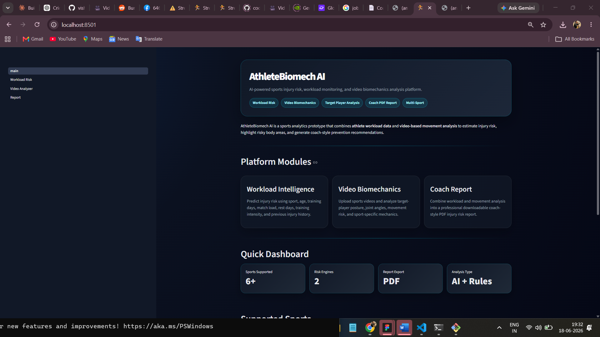

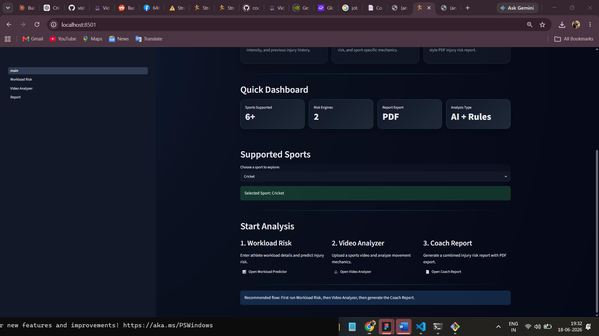

---

### 2. Workload Injury Risk Predictor

The workload risk module estimates an athlete’s injury risk using training frequency, match load, rest days, training intensity, age, sport type, and previous injury history. It combines rule-based logic with a trained machine learning model to generate a risk score, risk level, and sport-specific risk factors.

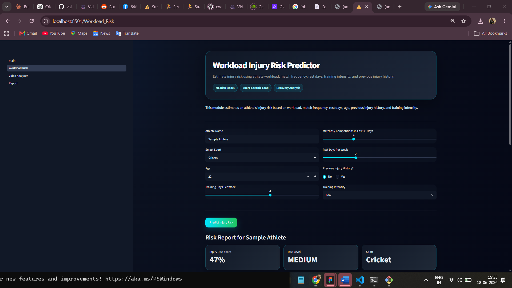

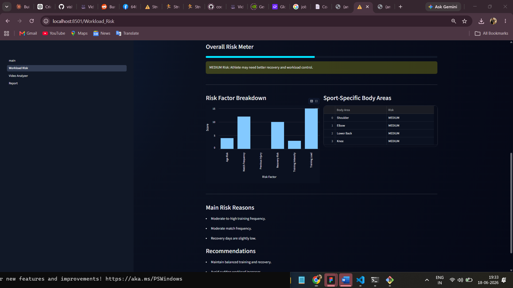

---

### 3. Video Biomechanics Analyzer

The video analysis module allows users to upload a sports movement video and analyze target-player biomechanics. It extracts frames, detects athlete posture, calculates joint-angle patterns, and identifies risky movement mechanics that may increase injury risk.

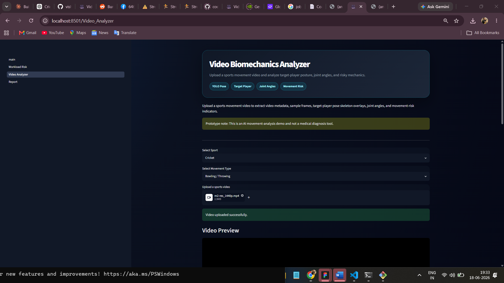

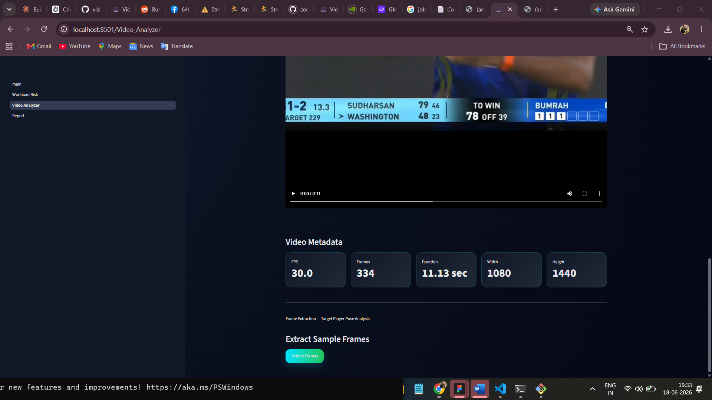

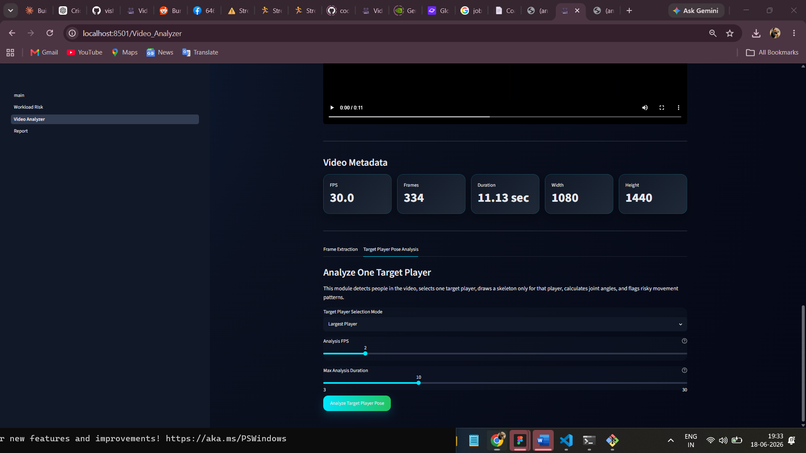

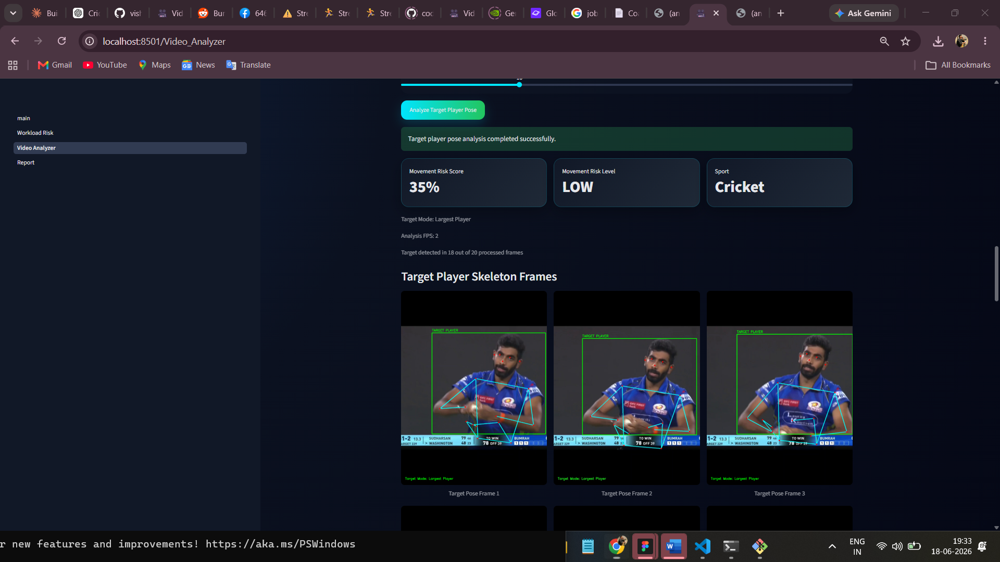

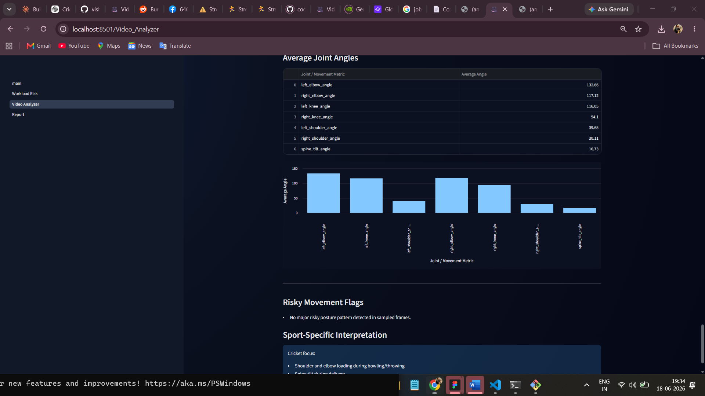

---

### 4. Coach Injury Risk Report

The coach report generator combines workload-based risk and video-based movement risk into one final injury prevention report. It summarizes the athlete’s risk score, risky body areas, workload reasons, movement flags, joint angles, and practical coach recommendations.

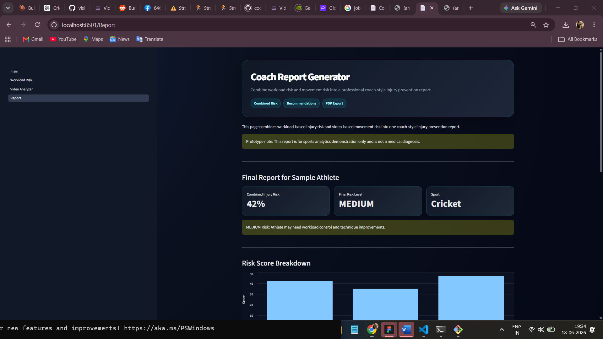

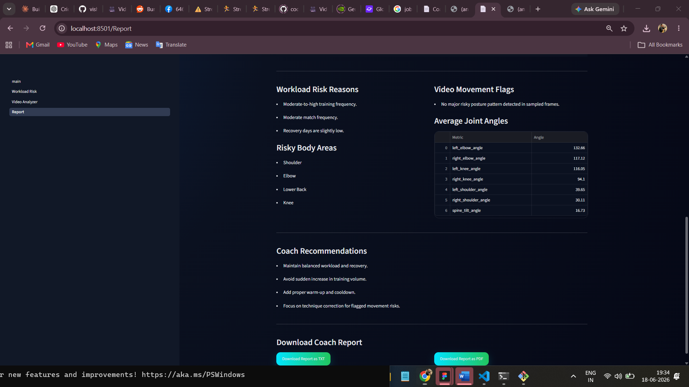

---

### 5. PDF Report Export

The platform supports downloadable PDF reports so coaches, trainers, or analysts can save and share athlete injury-risk insights in a professional report format.


